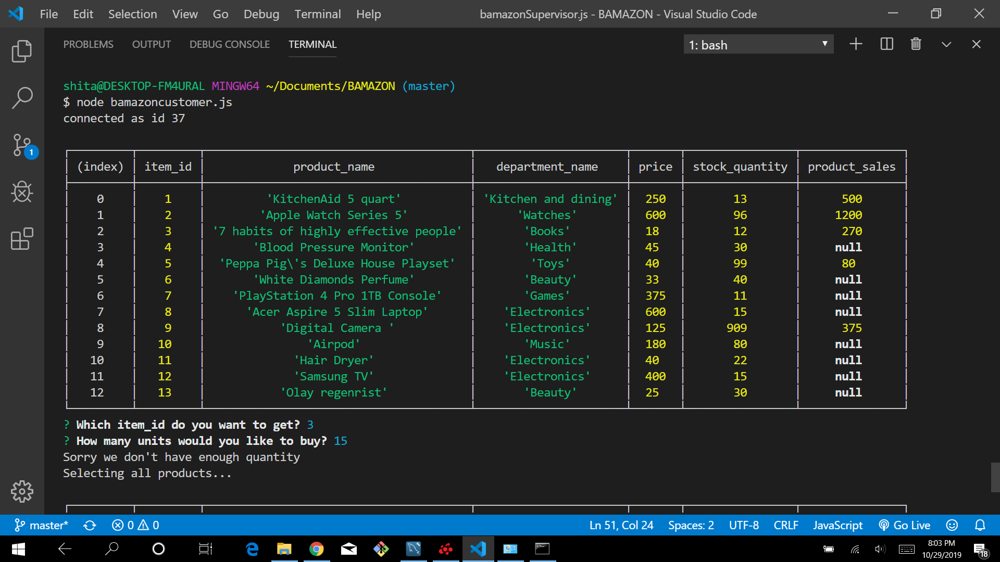
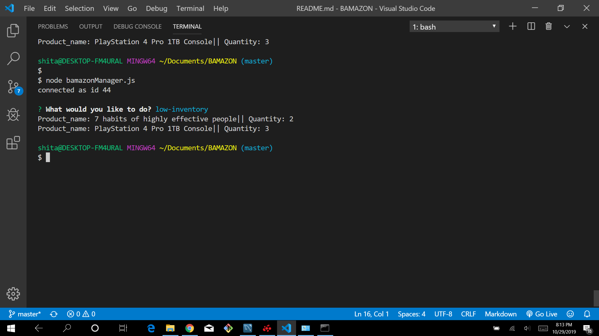

### BAMAZON :

#### Overview

The app  takes  orders from customers and deplete stock from the store's inventory. 

#### Technologies Used:

* MYSQL
* NODE.JS

#### SCREENSHOTS:
* If customer wants to buy something more than quantity we have in stock it shows 

* Manager choose low inventory from list it will disply lists of products less than 5 in quantity.

#### Code example:

 Ones user choose the product and quantity, this code tells if they have enough quantity and if is then tells the total cost and then display table with remaing quantity and products.

           var productName = answer.item;
           var index = answer.item-1;
           var newQuantity = stock[index].stock_quantity - answer.quantity;
           if (answer.quantity>stock[index].stock_quantity){
               console.log("Sorry we don't have enough quantity");
               chooseProduct();
           }else{
           var totalPrice = stock[index].price * answer.quantity;
           console.log("You total cost : $" +  totalPrice);
           var query = connection.query("UPDATE products SET ? WHERE ?",
           [
               {
                stock_quantity : newQuantity
               },
            {
                item_id : productName
            },
           ],
            function (err,res){
                if(err) throw err;
               console.log(query.sql);   
           readProducts();               
    });  

 
   Once manager decide which products and how many quantity he wants add this code add quantity:

        var index = answer.itemId-1;
        var newQuantity = (parseInt(stock[index].stock_quantity) + parseInt(answer.quantity));
        console.log(newQuantity);

        var query = connection.query("UPDATE products SET ? WHERE ?",[
            {
                stock_quantity : newQuantity
            },
            {
                item_id : answer.itemId
            },
        ],
        function(err,res){
            if (err) throw err;
            console.log("Your products has been updated");
            console.log(query.sql);
            viewProduct();
        },
        )
    });

#### Installation: 

* MYSQL
* inquirer

